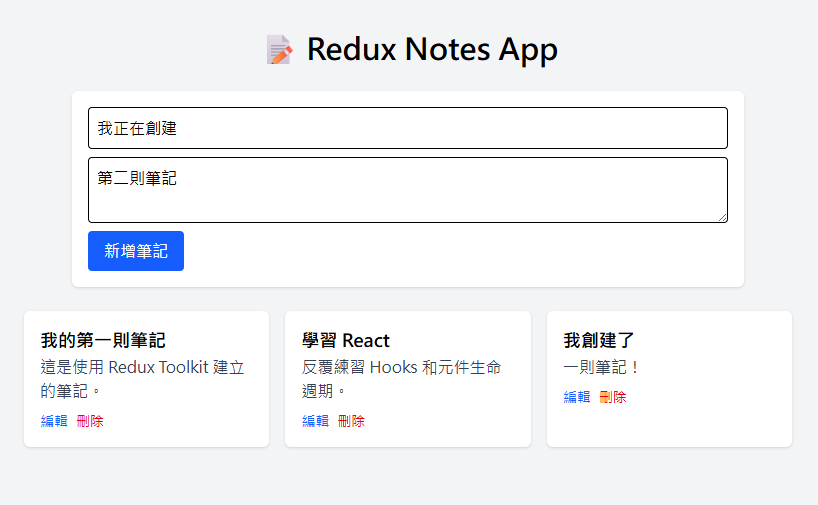
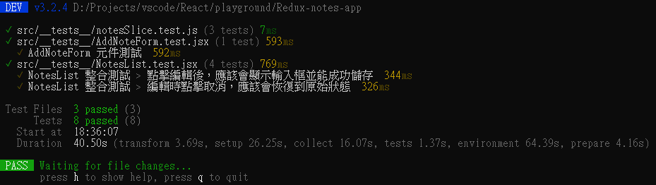

# Redux 筆記本

[**https://edrg2.github.io/Redux-notes-app/**](https://edrg2.github.io/Redux-notes-app/)

一個使用 React 與 Redux 打造的筆記本應用，旨在展示一個完整的現代前端開發流程，從開發、測試到自動化部署。

---

## 📌 專案展示

簡單的 Redux 筆記，包含 Create Read Update Delete 功能。

單元 -> 整合測試 共 8 條測試 All passed.

## ✨ 專案亮點

- **現代化開發工具**: 採用 Vite 作為建構工具，提升開發體驗。
- **狀態管理**: 使用 React-Redux 進行完整的筆記 CRUD 狀態管理。
- **本地持久化**: 利用 localStorage 儲存筆記，讓使用者在重整頁面後資料不遺失。
- **自動化測試**: 透過 Vitest 撰寫單元測試與整合測試，確保程式碼的穩定性。
- **CI/CD**: 建立 GitHub Actions workflow，實現推送程式碼後自動化測試與部署。

## 🛠️ 技術棧

  
  
  
  
  
  

##
